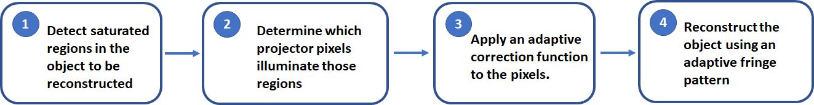
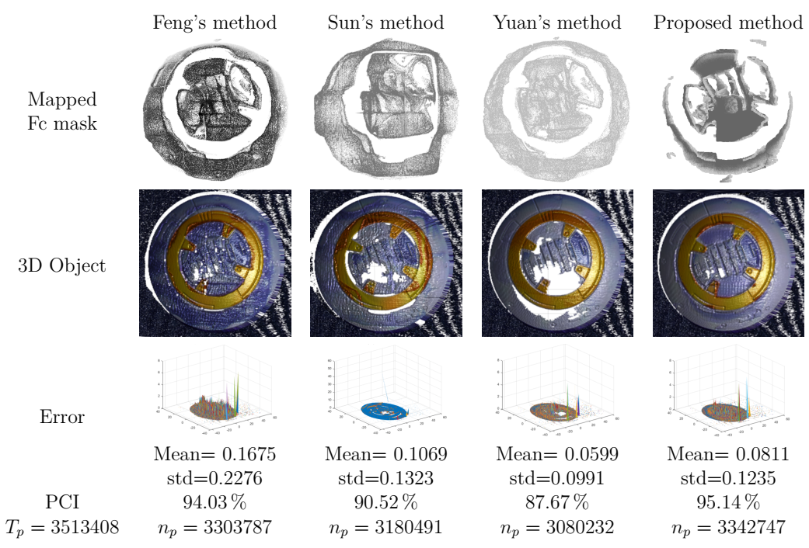
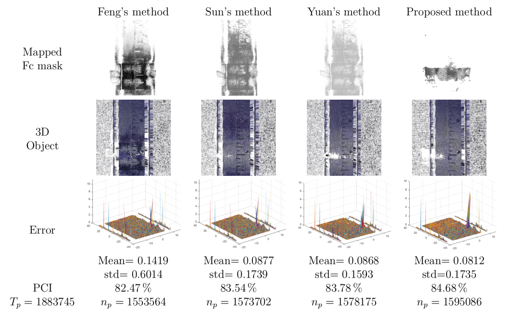

# Adaptive Fringe Projection for 3D Reconstruction

This repository presents a comparative analysis of different adaptive fringe projection methodologies for 3D reconstruction, particularly focused on objects with high-reflective surfaces.

---

## 📌 Overview

The project evaluates multiple state-of-the-art approaches and compares them with a proposed methodology developed in this research.

The goal is to analyze reconstruction performance under challenging reflectivity conditions, including plastic, metallic, and complex skin-like surfaces.

---

## 🧪 Evaluated Methodologies

### 1. **Label 2024**
**An adaptive fringe projection method for 3D measurement with high-reflective surfaces**  
🔗 https://doi.org/10.1016/j.optlastec.2023.110062  

---

### 2. **Label ref16**
**3D shape measurement method for high-reflective surface based on accurate adaptive fringe projection**

- Projects pattern \( t_1 \) with intensity \( I = 255 \)
- Captured image is converted to grayscale
- Uses correction factor \( F_c \) in saturated regions
- Reference intensity \( t_0 \) is estimated from the camera

---

### 3. **Label ref15**
**Adaptive fringe projection for 3D shape measurement with large reflectivity variations using image fusion and predicted search**  
🔗 https://doi.org/10.1155/2020/4876876  

---

## 🚀 Proposed Methodology

The proposed method improves adaptive fringe projection by enhancing phase estimation under saturation and reflectivity variations.




---

## 📁 Repository Structure

The dataset is organized into three main objects:

- **OBJ 1** → Plastic object with reflective surface  
- **OBJ 2** → Metallic surface object  
- **OBJ 3** → Complex skin-like surface simulator  

---

### 🔹 Reconstruction Details

- Most reconstructions were performed using **N = 6 phase-shifting steps**
- Exception:
  - `OBJ1/obj16` uses **N = 4 steps**, since original data was not preserved and replaced with later experiments

---

### 🔸 Internal Folder Structure

Each object folder contains:

#### 📂 `Cal`
Calibration data:
- `cp_params.mat` → Camera-projector calibration parameters  
- `fase_multi.mat` → Phase scaling factors (x and y directions)  
- `img__pts.mat` → Detected points in calibration images
- `imgxx.jpg` → Pose images for camera-projector calibration

---

#### 📂 `obj15`
3D reconstruction using **ref15 methodology**

#### 📂 `obj16`
3D reconstruction using **ref16 methodology**

#### 📂 `obj2024`
3D reconstruction using **2024 methodology**

#### 📂 `objme`
3D reconstruction using the **proposed method**

---

## 📊 Results Comparison

### 🔹 Plastic Surface Object (N = 6 phase shifts)

Comparison between:
- Feng method (ref15)  
- Sun method (ref16)  
- Yuan method (2024)  
- Proposed method  

<p align="center">
  
</p>


---

### 🔹 Metallic Surface Object (N = 6 phase shifts)

Comparison between:
- Feng method  
- Sun method  
- Yuan method  
- Proposed method  

<p align="center">
  
</p>

---

## 📌 Notes

- This repository is part of a research project focused on improving 3D reconstruction under challenging reflectivity conditions.
- The dataset includes raw captures, calibration data, and processed reconstruction results.
- All methods are implemented and evaluated under consistent experimental conditions.

---

## 📬 Contact

For questions or collaborations, please open an issue or contact the repository author.

```


